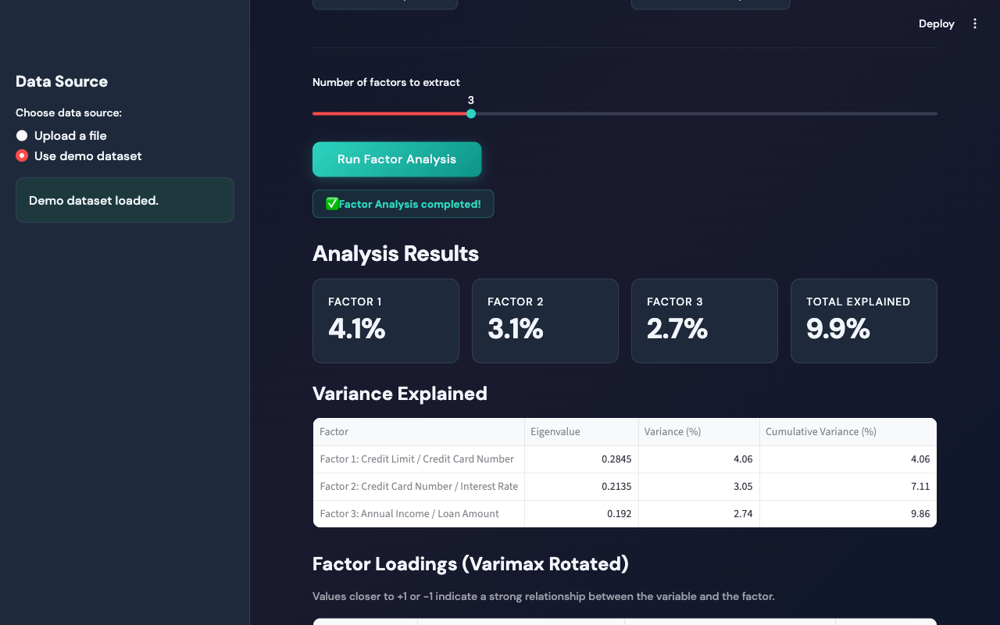

<div align="center">

# Factor Analysis Tool

[](https://python.org)
[](https://streamlit.io)
[](https://scikit-learn.org)
[](LICENSE)
[](https://docs.astral.sh/uv/)

**An interactive web application for exploratory factor analysis with varimax rotation, auto-labeled factors, and rich visualizations.**

[Report Bug](https://github.com/alfredang/factoranalysi/issues) · [Request Feature](https://github.com/alfredang/factoranalysi/issues)

</div>

## Screenshot

<!-- Add a screenshot of your app here -->
<!--  -->

## About

Factor Analysis Tool is a Streamlit-based web application that allows users to upload datasets (CSV or Excel), select variables, and perform factor analysis with varimax rotation. The tool automatically labels factors based on their highest-loading variables, making results easy to interpret even for non-statisticians.

### Key Features

- **File Upload** — Supports CSV and Excel (.xlsx/.xls) files, plus a built-in demo dataset
- **Interactive Variable Selection** — Checkbox-based UI with human-readable column names
- **Varimax Rotation** — Orthogonal rotation for clearer, more interpretable factor loadings
- **Auto-Labeled Factors** — Factors are automatically named by their top two loading variables
- **Comprehensive Output** — Variance explained, communalities, correlation matrix, and factor scores
- **Visual Analytics** — Factor loadings bar chart and factor scores scatter plot
- **Dark / Light Theme** — Toggle between themes with matching chart styling

## Tech Stack

| Category | Technology |
|----------|-----------|
| Frontend | Streamlit |
| Backend | Python 3.13 |
| Analytics | scikit-learn, NumPy, Pandas, SciPy |
| Visualization | Matplotlib |
| Package Manager | uv |

## Architecture

```
┌─────────────────────────────────────────────┐
│              Streamlit UI                    │
│  ┌──────────┐  ┌────────────┐  ┌─────────┐ │
│  │  Sidebar  │  │  Checkbox  │  │ Charts  │ │
│  │ Upload /  │  │  Factor    │  │ Bar +   │ │
│  │ Theme     │  │  Selector  │  │ Scatter │ │
│  └──────────┘  └────────────┘  └─────────┘ │
├─────────────────────────────────────────────┤
│            Analysis Engine                   │
│  StandardScaler → FactorAnalysis → Varimax  │
│  → Loadings, Scores, Variance, Communality  │
├─────────────────────────────────────────────┤
│            Data Layer                        │
│  CSV / Excel Upload  │  Demo Dataset         │
└─────────────────────────────────────────────┘
```

## Project Structure

```
factoranalysis/
├── app.py                 # Main Streamlit application
├── factoranalysis.py      # Reference factor analysis script
├── creditcarddata.csv     # Demo dataset
├── pyproject.toml         # Project configuration & dependencies
├── uv.lock                # Locked dependency versions
├── .python-version        # Python version (3.13)
└── .gitignore
```

## Getting Started

### Prerequisites

- Python 3.13+
- [uv](https://docs.astral.sh/uv/getting-started/installation/) package manager

### Installation

```bash
# Clone the repository
git clone https://github.com/alfredang/factoranalysi.git
cd factoranalysi

# Install dependencies
uv sync
```

### Running the App

```bash
uv run streamlit run app.py
```

The app will open at [http://localhost:8501](http://localhost:8501).

### Usage

1. **Choose a data source** — Upload your own CSV/Excel file or use the built-in demo dataset
2. **Select factors** — Check the variables you want to include in the analysis
3. **Configure** — Adjust the number of factors to extract
4. **Run** — Click "Run Factor Analysis" to see results
5. **Interpret** — Review factor loadings, variance explained, communalities, and visualizations

## Contributing

Contributions are welcome!

1. Fork the repository
2. Create a feature branch (`git checkout -b feature/my-feature`)
3. Commit your changes (`git commit -m 'Add my feature'`)
4. Push to the branch (`git push origin feature/my-feature`)
5. Open a Pull Request

## Acknowledgements

Powered by **[Tertiary Academy Pte Ltd](https://www.tertiarycourses.com.sg/)**

---

<div align="center">

If you found this project useful, please consider giving it a star!

</div>
